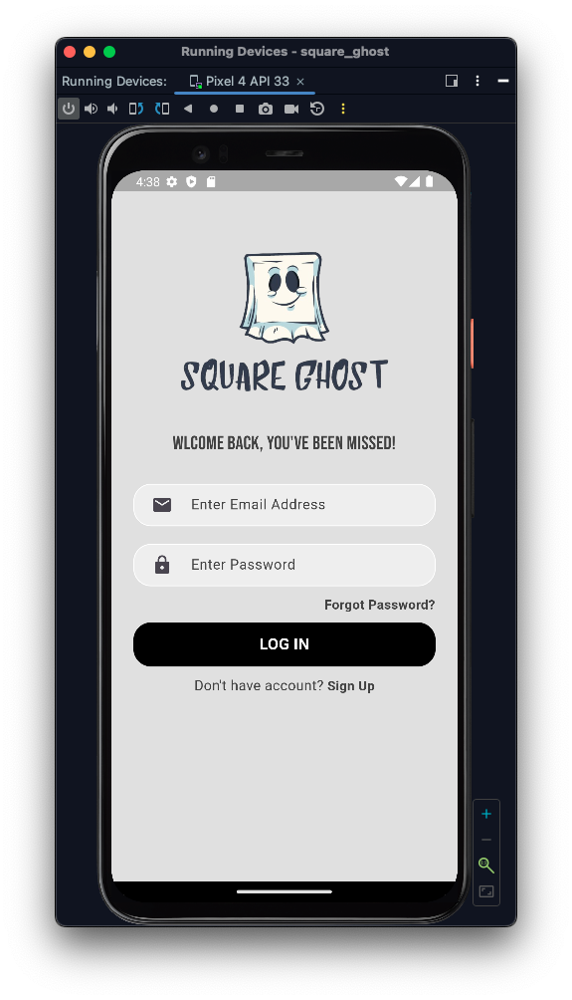
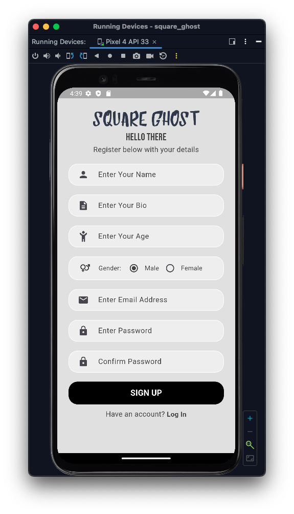
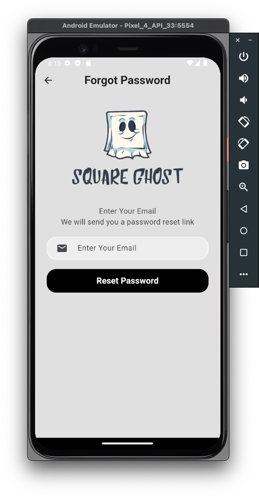
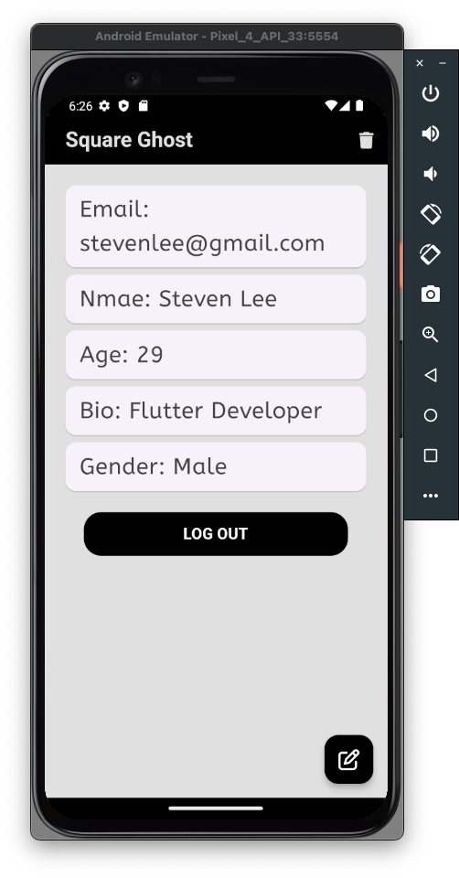
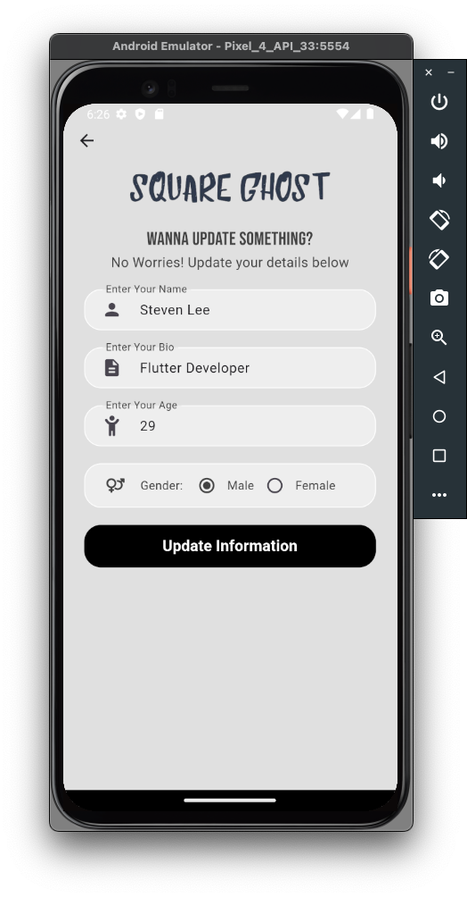

## Square Ghost

# Progress Pal: The Task Manager in Flutter!

Elevate your productivity with Progress Pal, a meticulously crafted task manager application designed to streamline your journey towards achieving your goals. With its sleek design and intuitive user interface, Progress Pal redefines task management, making it an indispensable companion for both personal and professional endeavors.

## Progress Pal UI

<div style="display: flex; flex-wrap: wrap;">
    
    
    
    
    
    
    
    
    
    
    
    
    
    
    
    
    
    
</div>


# App view







## Getting Started

### Prerequisites

Ensure Flutter is installed on your machine. For installation instructions, refer to the official [Flutter website](https://flutter.dev/docs/get-started/install).

### Installation

Follow these steps to run the Progress Pal Application:

1. Clone this repository to your local machine:

```bash
git clone https://github.com/muj-i/progress_pal.git
```

2. Navigate to the project folder:

```bash
cd progress_pal
```

3. Install dependencies:

```bash
flutter pub get
```

### How to Run

Connect your device or emulator and run the app using the following command:

```bash
flutter run
```
## Used Packages

Progress Pal integrates the following packages to enhance functionality:

- `flutter_svg: ^2.0.7`: Display Scalable Vector Graphics (SVG) images.
- `pin_code_fields: ^8.0.1`: Easily implement secure PIN code input fields.
- `font_awesome_flutter: ^10.5.0`: Access a wide range of Font Awesome icons.
- `image_picker: ^1.0.1`: Enable users to select images from their devices.
- `http: ^1.1.0`: Perform HTTP requests and interact with APIs.
- `google_nav_bar: ^5.0.6`: Create sleek, customizable bottom navigation bars with Google's Material Design.
- `flutter_launcher_icons: ^0.13.1`: Simplify the process of generating launcher icons on various platforms.
- `get: ^4.6.5`: Implement state management and dependency injection with the GetX library.
- `get_storage: ^2.1.1`: Local data storage and retrieval tasks using the GetStorage.

## Project Directory Structure

The Progress Pal directory structure is organized as follows:

```
  progress_pal/
  ├── assets/
  │   ├── logo/
  │   │   ├── logo_name.png
  │   │   ├── logo.png
  │   │   ├── logo2.png
  ├── lib/
  │   ├── pages/
  │   │   ├── auth_pages/
  │   │   │   ├── forgot_password_page.dart
  │   │   │   ├── lib/pages/auth_pages/logedin_checking_page.dart
  │   │   │   ├── lib/pages/auth_pages/login_page.dart
  │   │   │   ├── lib/pages/auth_pages/signup_page.dart
  │   │   ├── lib/pages/home_page.dart
  │   │   ├── lib/pages/update_user_data_page.dart
  │   ├── reusable_widgets/
  │   │   ├── lib/reusable_widgets/all_over_button.dart
  │   │   ├── lib/reusable_widgets/constants.dart
  │   │   ├── lib/reusable_widgets/delete_account.dart
  │   │   ├── lib/reusable_widgets/gender_selection.dart
  │   │   ├── lib/reusable_widgets/log_in_sign_up_button.dart
  │   │   ├── lib/reusable_widgets/selected_gender.dart
  │   ├── lib/firebase_options.dart
  │   ├── main.dart
```

## Contributors

- [Mujahedul Islam](https://github.com/muj-i)

## Special Thanks

### A heartfelt thanks to my mentors:

[Rabbil Hasan](https://github.com/rupomsoft) for his enlightening prerecorded class and [Md Rafat J. M.](https://github.com/RafatMeraz) for teaching me how to make UI like this and the API integration seamless.


## License

This project is licensed under the MIT License. Refer to the [LICENSE](https://opensource.org/license/mit/) file for details.
